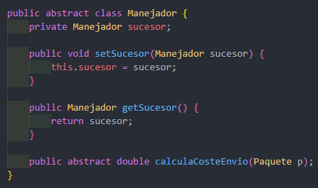
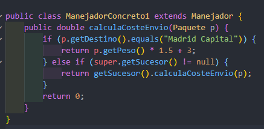
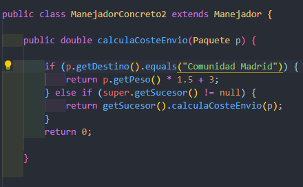
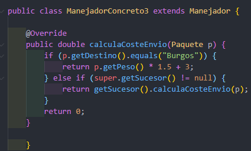
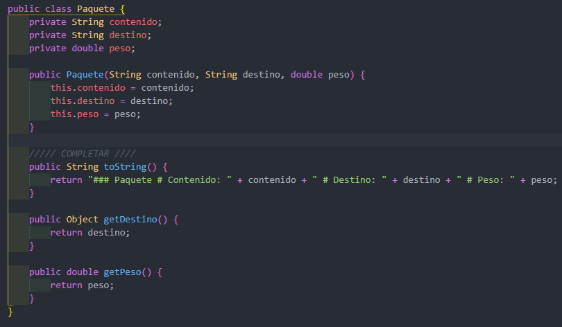
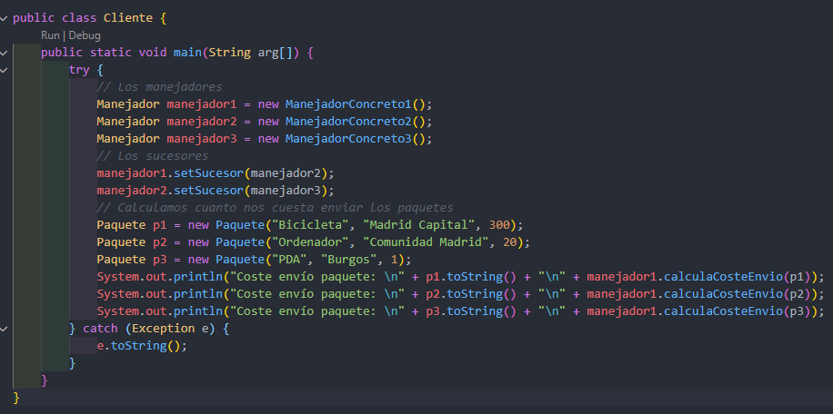
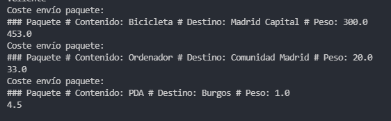

## Cade Responsabilidad

Es un patrón de comportamiento que evita acoplar el emisor de una petición a su receptor  dando a más de un objeto la posibilidad de responder a una petición. Para ello, se encadenan  los receptores y pasa la petición a través de la cadena hasta que es procesada por algún objeto.

Ahora, documentaremos lo que hicimos en el ejercicio.

Empezamos con la clase Manejador, esta es de tipo abstract donde en ella se crean las funciones  para obtener y establecer los sucesores, ademas de una funcion abstract de tipo doble, en esta  se pide que se calcule el costo de envio.

En la clase de Manejador de concreto 1, esta hereda de la clase manejador, esta se hereda  con la palabra clave de extends, despues en la funcion doble a esta le pasamos por parametro  paquete la instanciamos y creamos una condicion donde decimos que si destino  es igual a "Madrid capital" pues que nos retorne el peso y este lo miltiplicamos por 1.5+1 si no,  si el sucesor que obtenemos es diferente que null entonces que nos retorne el sucesor con el  costo de envio.

En la clase manejador de concreto 2 al igual que la anterior hereda de manejador,  luego hacemos la misma funcion a diferencia que esta la igualamos con  "Cominidad madrid"

La clase Manejador concreto 3 es igual a la uno y dos ya que hereda de manejador  y su funcionalidad es similar a diferencia que esta iguala con "Burgos".

En la clase paquete en esta lo hacemos es declarar 3 variable de tipo string, despues  un constructor lleno, despues una funcion de tipo string donde en ella retornamo los  valores string y por ultimos las funciones obtenedora y establecedora.

Por ultimo la clase cliente, En esta lo primero que hacemos es instancionar los manejadores,  uno, dos y tres, despues le establecemos los manejadores, posteriomente instacionamos paquete,  le pasamos los parametro y listo despues ejecutamos y listo

RESULTADO!

