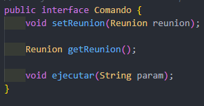

## comportamiento Comando

Documentacion del ejercicio asignado.

Lo Primero que hacemos es crear una interfaces llamada Comando,  ella modela el comportamiento genérico de los comandos con las funciones.

Esta otra interfaz hereda de la interfaz comando con el objetivo  de hacer mas grande la interface ampliandola con los metodos deshacer y rehacer.

La clase Comando cambiar fecha esta implementa los atributos de la interface  ComandoDeshacer, aqui ya damos la funcionalidad de los metodo es es decir  ya hacemos las ordenes asignada por la interface.

La clase Comando cambiar localizacion al igual que la anterior implementa  los atributos de la interface ComandoDeshacer, aqui ya damos la  funcionalidad de los metodo de la interface.

La clase fecha en esta lo primero que hacemos es declarar las variables que utilizaremos  luego crearemos lo que es un constructor lleno, este nos servira para dar  la fecha en entero,despues otro de tipo string usando la herramienta de Stringtokenizer  que sirve para dividir las cade en tokens es decir en pequeño fragmento, luego le decimos que los divida con "/" luego declaramos las 3 variables que utilizamos y la igualamos y por ultimo la convertimos a entero, despues creamos una funcion fecha esta   servira para que nos de la fecha en tiempo real y por ultimo creamos todos los  obtenedores y establecedores.

La clase Invocador, en esta clase instanciamos la interface ComandoDeshacer,  despues le damos las funcionalidades a las funciones de tipo void.

La clase reunion, en esta declaramos tres variables para de tipo privado  y intanciamos la clase fecheHora, despues construimos un cosntructor  lleno con las variables y por ultimo las variables obtenedoras y establecedora.

Resumiendo todo el codigo, Para finalizar en la clase cliente intanciamos  las clase que se necesitaran como FechaHora,Reunion,ComandoDeshacer  y invocador, pasamos lo que deseamos ejecutar por parametro y listo  ejecutamos y obtenemos los resultado.

RESULTADO!

